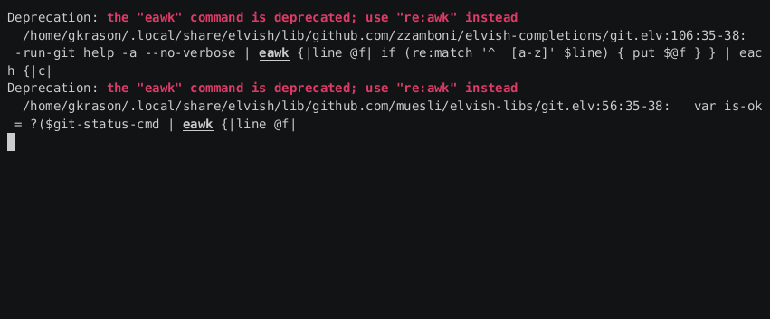
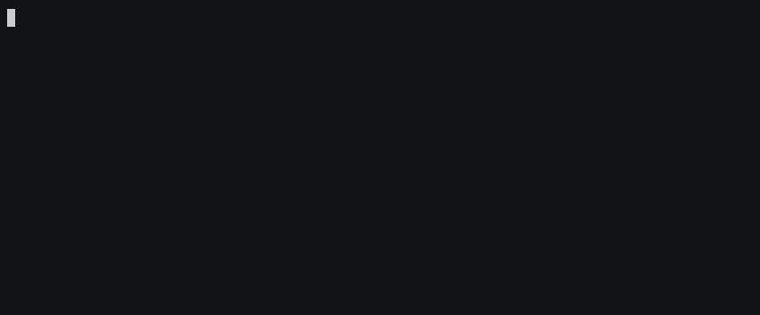

# Plany


[  ](https://github.com/gergelyk/plany/releases)


[  ](https://gergelyk.github.io/plany/event_formats.html)
[  ](https://gergelyk.github.io/plany/date_specs.html)
[  ](https://github.com/gergelyk/plany/tree/main/example)

Manage your calendar in YAML.



## Motivation

It's yet another calendar application. Build with the following goals in mind:

- Events should be minimal. They consist of a title and date specification.
- Date specification should be human readable and intuitive.
- Data should be stored in a common file format. Easy to backup and edit in a text editor.
- Application should provide clear overview showing as much of the timeline as possible.
- All the functions should have intuitive key bindings assigned.

## Data Files

Data files should be placed in `$XDG_DATA_HOME/plany` (typically `~/.local/share/plany`).

Structure of sub-directories is fully defined by the user. Example can be found in [here](example/data).

Calendar events are stored in YAML files. Each YAML file consists of dictionaries building a tree.
Leaves of the tree define events. Structure of dictionaries is a continuation of directory structure.

There are three formats of the leaves available. Keep on reading about them [here](https://gergelyk.github.io/plany/event_formats.html)

## Date Specifications

Date specs determine when events occur. They consist of primitives combined by operators. For instance:

```
1,5 2025/6- !wed
```

Means *1st and 5th day of each month from June 2025 onward, as long as it isn't Wednesday*.
`1`, `5`, `2025/6-`, `wed` are primitives. `,`, `!` and space are operators. We will take a closer
look at them in the following [document](https://gergelyk.github.io/plany/date_specs.html).

Note that the application can be run as `plany play`, which allows for testing different data specs:



## Configuration Files

Configuration files should be placed in `$XDG_CONFIG_HOME/plany` (typically `~/.config/plany`).

There is currently one configuration file required: `views.yaml`. It should contain a dictionary where keys
are names of the *views* and values are lists of paths. Paths point to the branches or leaves in the data files. Each path corresponds to a single row in the user interface.

For an example take a look at `example/config/views.yaml`.

**Currently only one view called `default` is supported.**

## Installation

Either download precompiled binary, or compile it from sources:

1. Install [crystal](https://crystal-lang.org/) ~1.11.2 compiler.
2. Clone this repository and enter into it.
3. Build executable and copy to the place of you choice.

```sh
shards build --production --release --no-debug
cp bin/plany ~/.local/bin/
```

## Development

Building:

```sh
shards build --debug
```

Running tests:

```sh
crystal spec
```

### To Do

- Support multiple views
- Implement vertical scroll bar
- Consider new primitives in the date specs
